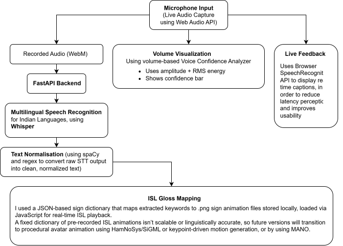

**SunoSaathi – Speech to Indian Sign Language (ISL) Translation System**
SunoSaathi is an end-to-end applied AI prototype that converts spoken English speech into a sequential Indian Sign Language (ISL) visual output, aimed at improving accessibility for deaf and hard-of-hearing users.
The project focuses on audio processing, NLP-based semantic filtering, and system integration, rather than training new ML models.

🚀 **Why This Project Matters**
- Demonstrates end-to-end system ownership
- Handles real-time audio, NLP, and backend inference
- Shows engineering tradeoffs and limitations clearly
- Built around a real-world accessibility problem
  
🧠 **Pipeline**

